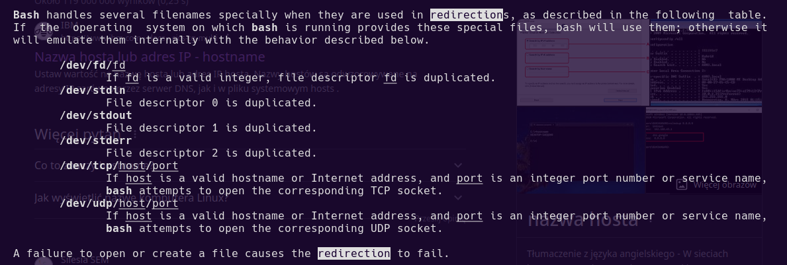

jeśli dobrze rozumiem zadanie to chodzi o to że oprócz przekierowania do pliku możemy otworzyć sobie plik /dev/tcp/<hostname>/<port>

i reszta jest normalnie jak była
możemy zapisywać odczytywać 

Przykładowe połączenie
exec 3<> /dev/tcp/www.ippages.com/80
echo -e "GET /simple/?se=1 HTTP/1.1\n" >&3
cat <&3